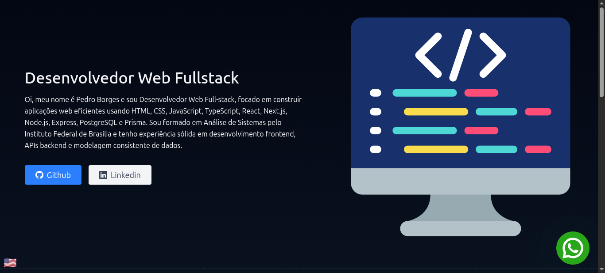

# Portfolio




> This is just my portfolio design.

## Prerequisites

Before getting started, make sure you meet the following requirements for a Node.js project:

- You have the latest LTS version of Node.js and npm installed.
- You are using a compatible operating system (Windows, Linux, or macOS). All three are supported.
- You have read the relevant project documentation or setup guide.

## Technologies

- Vite
- HTML
- Typescript
- React.js
- Tailwind CSS
- react-icons
- AOS

## Installing

To install it, follow these steps:

```bash
git clone https://github.com/dspedroborges/portfolio
cd portfolio
npm install
```

## Using it locally

To run the project:

```bash
npm run dev
```

To build the project:

```bash
npm run build
```

## Live Demo

You can try it live at: [Live Demo](https://borgespedro.com.br/)

## License

This project is under license. See the file [LICENSE](LICENSE.md) for more details.